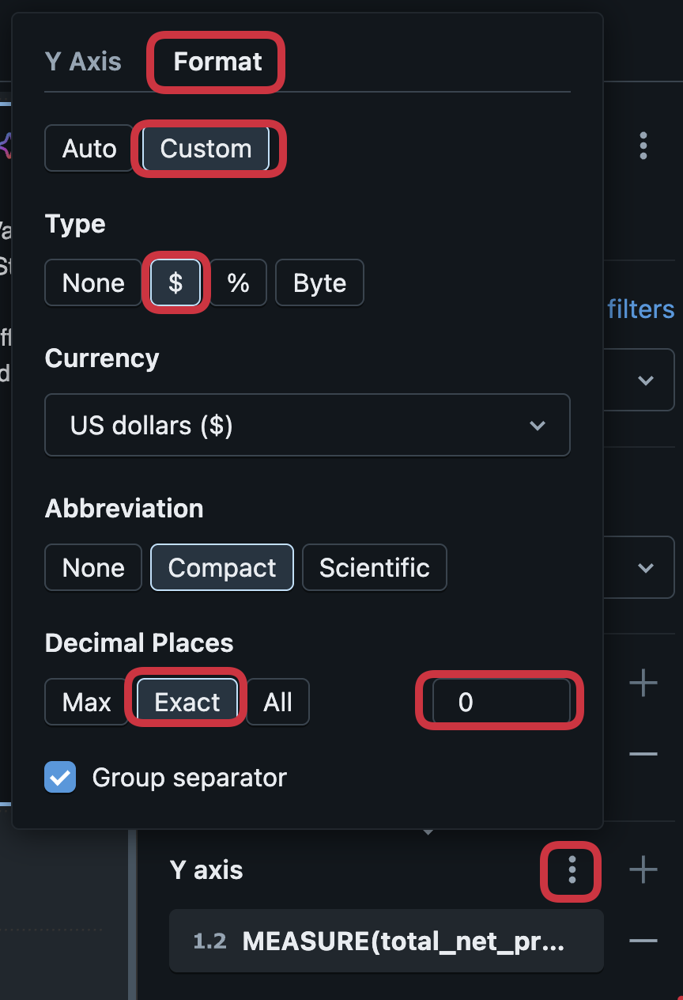
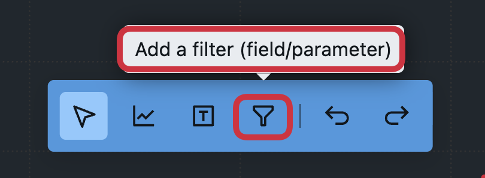
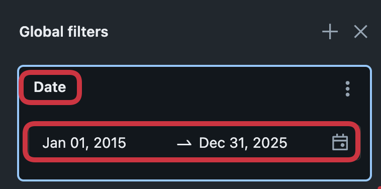
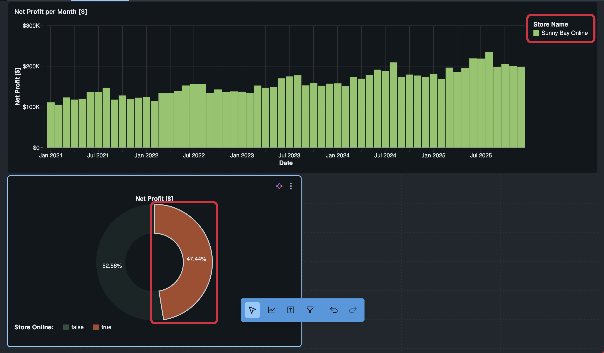
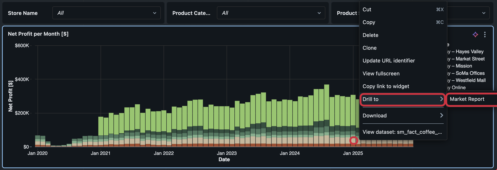
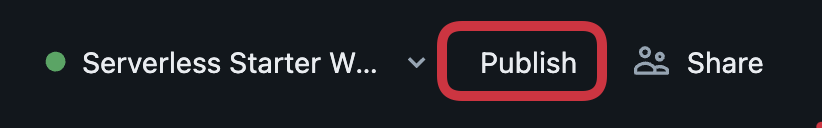

# 🧪 Lab 2 – Creating an AI/BI Dashboard

## 🎯 Learning Objectives

By the end of this lab, you will be able to:

- Use a Databricks Metric View as the primary semantic source for dashboard visuals.
- Build interactive AI/BI Dashboards including charts, filters, drill-downs, and summary tiles.
- Add and configure global filters (e.g., date, store, product) to make dashboards fully interactive.
- Use AI-assisted visual creation to accelerate dashboard building with natural-language prompts.

## Introduction

**What Are AI/BI Dashboards?**

Databricks Genie is an AI-powered, natural-language interface that lets business users ask questions about their data in plain English and get back answers as tables, charts, and summaries without writing SQL or building reports first. It sits on top of governed datasets like Unity Catalog metric views, so all insights respect existing security, governance, and business definitions.

With Genie, teams can:
- Go beyond static dashboards and get on‑the‑fly answers to new questions that weren’t pre-modeled in reports.
- Self‑serve insights using conversational prompts, reducing dependency on data engineers and analysts for every new question.
- Rely on consistent metrics and semantics defined in Unity Catalog and the Genie knowledge store, improving accuracy and trust in results. 

## Instructions

Before you start, please verify:
- The **Sunny Bay Coffee Sales metric view** from Lab 2 is created and published in Unity Catalog.

**Step 1: Open the AI/BI Dashboard Template**
AI/BI Dashboards can be stored as a templates which contain the corporate identity, logos, and more elements that should be standardized.

1. In the Databricks workspace, open **Dashboards** from the left navigation.
2. Open the Dashboard "[Template] Sunny Bay Roastery - Sales Report"
3. You are now viewing the Dashboard from the perspective of a **Dashboard Consumer**
4. Click on "Edit Draft" to switch to the **Dashboard Creator** perspective

  

**Step 2: Configure the Metric View as a Data Source**
Every AI/BI Dashboard must have one or more data sources, which are used to create visualization.

1. Click on the "Data" tab to select the source data for the Dashboard
2. Click on "Add data source", and select the Metric View from Lab 2 as the data source

  

**Step 3: Create Your First AI-Assisted Visual**
The Databricks Assistant xxx 

1. Switch back to the "Sales Report" tab
2. Click on the "Add a visualization" icon

  

3. Ask the AI Assisstant in the visualization to "_Create a bar chart that shows the net profit over date aggregated by month_"
4. Press "Accept" when you are satisfied with the visualization. If not, press "Reject", and refine the prompt.

  

4. Change the format of the Net Profit to the type "$" with no decimal places.
 

  

5. Rename the axis title to "Net Profit [$]"
6. To group the sales by store, click on the "+" next to the "Color" field in the widget settings, and choose the value "store_name"

  

7. Add the measures "total_costs_of_goods" and "total net revenue" as tooltip
8. Rename the tooltip values to "Total Costs of Goods [$]" and "Total Net Revenue [$]"
9. Rename the title to "Net Profit per Month [$]"

**Step 4: Add a Page Level Filter for the Store Name**

1. Click on the "Add a filter" icon

  

2. Select "Multiple values" as the filter type in the widget settings
3. Choose the value "store_name" in the fields selection
4. Rename the title from "store_name" to "Store Name"
5. Duplicate the filter widget twice, by selecting it, pressing "CTRL + C", and "CTRL + V"
6. Rename the first duplicate to "Product Category", remove the existing value from fields, and select "product_category"
7. Rename the second duplicate to "Product Subcategory", remove the existing value from fields, and select "product_subcategory"
8. Filter the product category for "Food", and see how the values in the filter product subcategory are effected

**Step 5: Add a Global Filter**

Global filters are helpful to apply a filter for multiple report pages. We are going to filter out all the sales before 2015.

1. Click on the "Show Global Filters" icon

  

2. Click on the "+" icon to add a new global filter widget
3. Select the "Date Range Picker" as the filter type
4. Choose data as a field
5. Rename the widget from "date" to "Date"
6. Change the filter from "Jan 01, 2015" to "Dec 31, 2025"

  

7. Minimize the global filters by clicking on "Hide Global Filters"

**Step 6: Explore Cross-Filtering**

1. Make sure that all report level filters are not applied
2. Create a new visualization by clicking on "Add visualization"
3. Select the "Pie" as visualization type
4. Choose the "total_net_profit" as the angle, and "store_online" as the color
5. Change the colors for the values "true", and "false" 
6. Rename the aanglexis title to "Net Profit [$]"
7. Activate labels for this visualization
8. Click on the one of the values of the pie chart, and see how the cross-filtering functionality effects the bar chart

  

**Step 7: Create a Map Visualization**

1. Create a new visualization by clicking on "Add visualization"
2. Select "Point map" as visualization type
3. Select the dimensions "store_latitude", and "store_longitude" for the coordinates
4. Choose the measure "total_net_profit" as the size
5. Use the dimension "product_category" as the color
6. Rename the color to "Product Category"
7. Click on the kebap menue of the map visual and click on "View fullscreen"

  

8. 

**Step 8: Explore the Drill-Through Feature**

1. Clone the report page "Sales Report", and rename the clone to "Market Report"
2. Remove all the visuals and report-level filters, but keep the text boxes on the top
3. Rename the text box "Sales Report" to "Market Report"
4. Create a new visualization by clicking on "Add visualization"
5. Select the visualization type "Heatmap"
6. Choose "day_of_week" for the x-axis, and "product_name" for the y-axis
7. Select "total_net_profit" as the color
8. Activate labels for this visualization
9. Rename the x-axis titles to "Net Profit [$]"
10. Change the x-axis scale type to "categorical"
10. Jump back to "Sales Report" page
11. Drill into the market report by rightclicking on the value for one store, clicking "drill to", and "Market Report" 

  

12. The filter is propagated to the "Market Report", and the revenue for each product grouped by day of the week is displayed
13. Reset the filter by clicking "Reset all to default"

**Step 9: Publish the Report**

1. Congratulations, the report is ready for production. Click on "Publish" to make the report available for report consumers. 

  

2. Select the "Individual data permissions" and click publish
3. Click on the "View Published" button to switch to the perspective of a **Dashboard Consumer**
4. Download the Dashboard as a PDF by clicking on the kebap menue and "Download as PDF"

**Step 10: View the Report as a Consumer**
1. Open the Databricks One UI

  

2. Search for the report, or click on "Dashboards" to find all available dashboards

